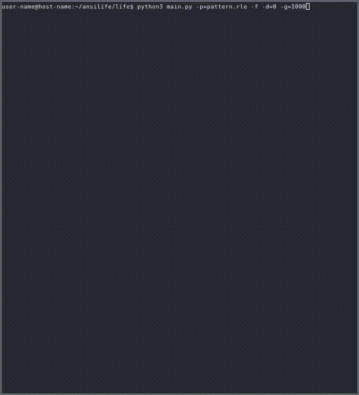
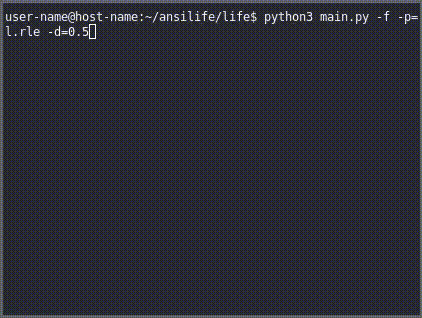
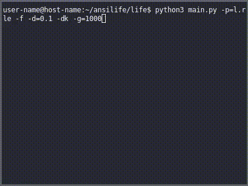

# AnsiLife

AnsiLife is a Simple Unix terminal [Game of life](https://en.wikipedia.org/wiki/Conway%27s_Game_of_Life)
viewer written in Python that utilizes ansi escape sequences to render the generations into the terminal.

## Features

- Ansi Escape Sequences
- Dark mode :O
- RLE encoder and decoder (to play and save pattern)
- GIF recorder (every generation will be recorded as a gif)
- Generate random patterns
- Change pattern size
- Choose delay betweenn generation

# Patterns

| Glider 		       | Blinker 			| Pulsar 		       |
| :---:  		       | :---:    			| :---: 		       |
|  |  |  |

## Requirements

- Unix like system
- Python >= 3.9
- Support to ansi escape sequences and [1bit color](https://en.wikipedia.org/wiki/Color_depth)
- [Pillow](https://github.com/python-pillow/Pillow)

# Gosper glider gun in dark mode

## Arguments
-  `-h,  --help            → show this help message and exit`
-  `-v,  --version         → show program's version number and exit`
-  `-p,  --pattern         → path of the pattern file encoded in erl format`
-  `-g,  --gen             → number of generations to occur in pattern`
-  `-d,  --delay           → delay between each generation`
-  `-r,  --rows            → number of rows that pattern should have`
-  `-c,  --columns         → number of columns that pattern should have`
-  `-f,  --fill            → number of rows and columns the same as terminal screen`
-  `-rm, --reduce-matrix   → reduce matrix border if it's not being used by pattern`
-  `-em, --expand-matrix   → expand matrix border if it's being used by pattern`
-  `-sv, --save            → save the last generation of pattern to a given path encoded in rle`
-  `-dk, --dark-mode       → graphics of pattern will be black background and white foreground`
-  `--gif                  → save all the generations into a gif (10 fps)`

## Made by [Sivefunc](https://gitlab.com/sivefunc)
## Licensed under [GPLv3](LICENSE)
